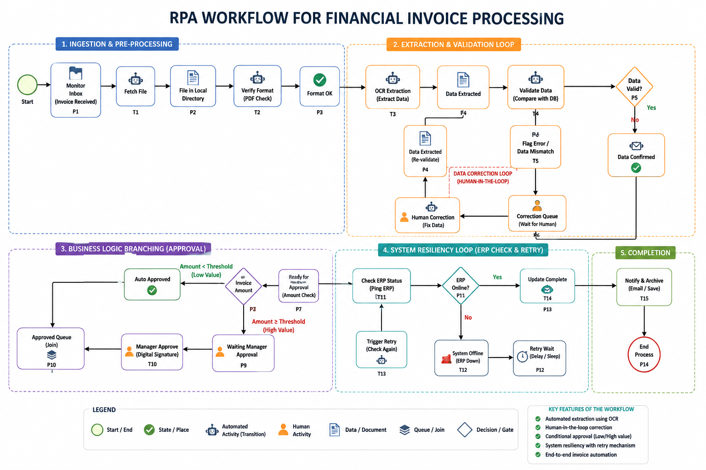
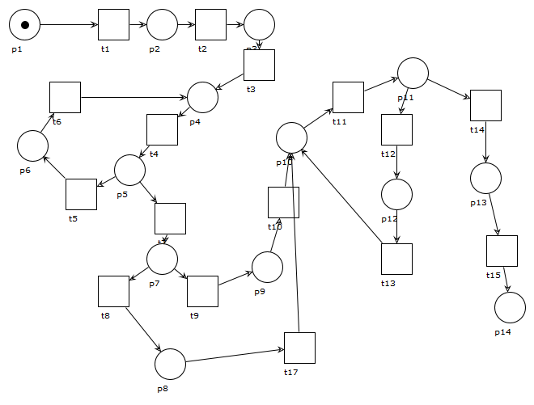

### Title: Automated Invoice Processing Modelling and Verification Using Petrinets

### Author: Vaishnav Krishna P, Victor RL Shen

### Abstract
Robotic Process Automation (RPA) is widely used in financial systems to automate repetitive tasks such as invoice processing; however, ensuring workflow correctness and reliability remains a challenge. This paper presents the modeling, analysis, and formal verification of an automated financial invoice processing workflow using Workflow Petri Nets (WF-Nets). The proposed workflow is modeled and evaluated using WoPeD 3.8 and PIPE 4.2 to examine key behavioral and structural properties of the system. Formal verification is performed to validate essential Petri Net properties including soundness, liveness, boundedness, and deadlock-freeness. The analysis results confirm that the workflow operates correctly and reaches the intended completion state without process inconsistencies or stalled execution states. The study demonstrates the applicability of Petri Net-based verification techniques for improving the reliability and correctness of RPA-based financial workflows.

### Workflow

### Woped Modelling

